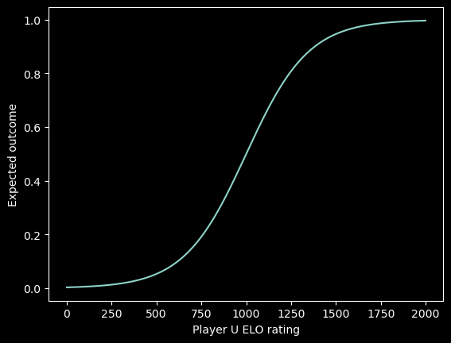
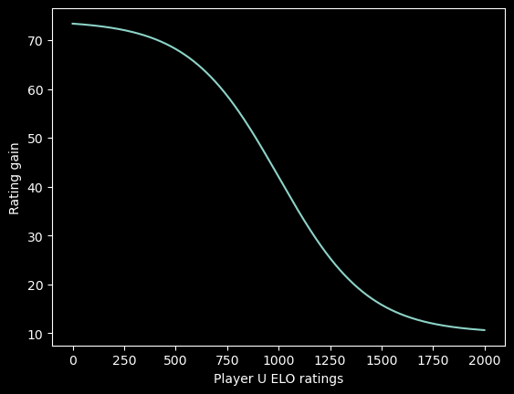

#  RF Ping Pong ELO
  
  
*This is a pilot of the system. Rules are subjected to changes at short notice.*
  
System for calculating ELO ratings for ping pong games at the Random Forest room.
  
##  TL;DR
  
  
First, calculate your expected score of the match:
  

  
  
  
Then, we can update your score based on the outcome as

  
  
  
where
  

  
  
  
For multiple games  played in a row,  is a binary vector, and
  

  
  
  
Player starts with ELO ratings of 1000 (Bronze). The different ranks are
  
- Bronze: 1000-1199
- Silver: 1200-1399
- Gold: 1400-1599
- Platinum I: 1600-1799
- Platinum II: 1800-1999
- Diamond: 2000+
  
**After finishing your game**, calculate your new ratings and put it on the ranking board, which should be seen easily in Random Forest.
  
GLHF! You can read the text below to understand the ranking calculation in detail.
  
##  Basics
  
  
We use a numerical rating to represent the skill level of each player. The higher the rating, the better the player is assumed to be. When two players compete, their ratings are used to calculate the expected outcome of the game. The expected outcome is then compared to the actual outcome, and the ratings are adjusted accordingly.
  
**Expected Outcome**
Each player starts with an initial rating of 1000. Given a player and a opponent, to calculate new ratings after a game, we first need to calculate the expected outcome of the game:
  

  
  
  
The expected outcome, ranges from 0 to 1, shows how likely the player wins against the opponent[^1]. The higher the player ratings, the higher the expected outcome.
  
**Updating Ratings**
After the game, we can update the player's rating based on the outcome. If the player wins the game, the actual outcome is 1, and if the player loses, the actual outcome is 0. The new rating is calculated as follows:
  

  
  
  
where the floor function, denoted by , rounds down to the nearest integer. The rating change depends on the difference between the expected outcome and the actual outcome, with larger differences resulting in larger rating changes.
  
**Multiple Games in a Row**
For a long chain of games ,  should be a binary vector. Thus, we can calculate the new rating at once by summing the chain of actual outcomes and expected outcomes (a vector if multiple players are present):
  

  
  
  
**Rankings**
To provide a better sense of progression and achievement, we can associate different rating ranges with different rankings. The ranking system for our ping pong ELO rating system is
  
- Bronze: 1000-1199
- Silver: 1200-1399
- Gold: 1400-1599
- Platinum I: 1600-1799
- Platinum II: 1800-1999
- Diamond: 2000+
  
**Ranking Tracking**
  
1. Write your name on the board along with the starting rating (1000), if this is your first time.
2. After you finished the match, calculate your new ratings follow the formula and write it next to your name.
3. Write down your corresponding ranking.
4. Go for another game (if you don't have anything else to do)!
  
**Example**
  
Suppose two players, Bro and Ilon with ratings  and , respectively, play a series of 5 games on a normal day at Random Forest. The winner of the games in chronological order are Bro, Ilon, Bro, Bro, and Ilon. We see that the actual outcome vector w.r.t. Bro is  and Ilon is . To calculate the new ratings  for Bro and Ilon, we first calculate their expected outcome as
  

  
  
  
Given these quantities, we can finally calculate the new ratings,  and , using the expected outcomes and actual outcomes vectors for the two players as
  

  
  
  
##  Analysis
  
  
Denote ,  as the ratings and expected out come of the match. Given player  and  with ratings  and , respectively, the expected outcome w.r.t. player  is

  
  
  
The value of  shows how likely the player U wins against the opponent V. For example, if the ratings of both the player and the opponent are 1000, the expected outcome is . On the other hand, suppose player has a ratings of 1200, and the opponent has a ratings of 1000. The expected outcome is . The interpretation is we assume that either the player and the opponent win 50% of the time in the previous case, while the player and the opponent are expected to win 72% and 28% of the time, respectively, in the latter case. In fact, we can see how the expected outcome changes, when we fix  and vary  in this figure:
  

  

  
To apply this analysis to different opponent ratings, one can imagine shifting this curve to center on such ratings. In addition, the expected outcome formulation is equivalent to
  

  
  
  
where  and . It follows that for each 400 rating points U has over V,  is magnified 10 times over . For example,
  

  
  
  
Denote the outcome  w.r.t. player U as , and  as the new ratings of player  after a match. The formula for updating player U's rating is
  

  
  
  
How do the rating gains for U differ for different ? Assume U wins in a game against V, we conduct the same analysis with the expected outcome by fixing  and yield
  

  

  
##  Redefining the Game
  
  
If the ELO system feels unbalanced, lopsided or unfair in general, we can modify the formulas for calculating the ratings.
  
**Expected Outcome**
Let us revisit the expected outcome formula and replace :
  

  
  
  
We see that this is the generalized version of the expected outcome calculation. As mentioned,  represents the ratings difference such that  is magnified 10 times over . This corresponds to the assumption of the level of playing at different rating levels. In particular, we are assuming player  with  ratings have the skills to win 9 out of 10 matches against against player  with . With , for example, we think that Gold-ranked players should win 9 out of 10 matches against Bronze players.
  
**Rating Updates**
Regarding the generalized rating updates formula, we encounter another tune-able parameter  and :
  

  
  
 serves as a baseline of number of point given, such that this ELO system is not a zero-sum game.  should be very small, around th of the starting ELO, to prevent it from affecting the general competitive landscape. On the other hand,  basically decides the sensitivity of the ratings system. When  is high, winners gain more points and losers lose more, and vice versa. There are more advanced schemes for setting , mostly revolving around setting K higher when  is higher. Nevertheless, we use a fixed  for simplicity in our novel system.
  
[^1]: One can notice that this is the [logistic function](https://en.wikipedia.org/wiki/Logistic_function ) with base 10, , , and .
  